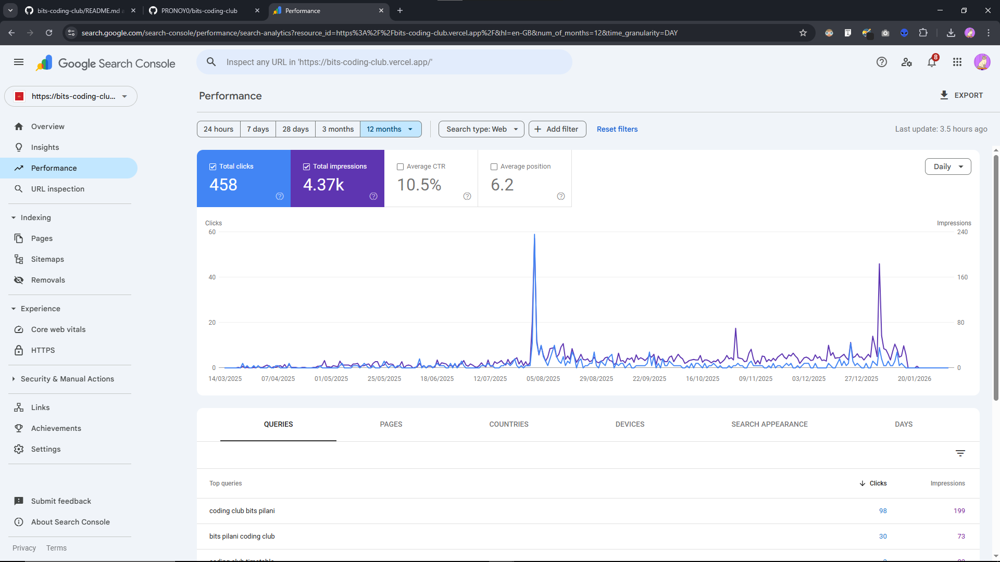

# BITS Pilani Coding Club Platform

> Official coding club platform serving 500+ members. Achieved 180+ monthly organic visitors and ranked #1 on Google for target keywords.

## 🎯 Impact

- 180+ monthly organic visitors through SEO optimization
- Ranked #1 for "[bits coding club]" keywords, outranking institutional sites
- Cross-college interest: Approached by other institutions (KIT) for implementation
- Codebase adopted by BITS Pilani for official deployment

## ✨ Features
- Event Management System: Create, edit, and manage coding events with RSVP tracking
- Admin Dashboard: Comprehensive admin panel for club management
- Project Showcase: Display student projects with live demos and code links
- Responsive Design: Mobile-first approach with smooth animations

## 🛠️ Tech Stack
- Framework: Next.js 15 with TypeScript (App Router)
- Database: MongoDB
- Styling: Tailwind CSS
- Authentication: NextAuth.js
- Deployment: Vercel

## 📊 SEO Strategy
Implemented comprehensive SEO optimization:
- Semantic HTML structure
- Dynamic meta tags and Open Graph data
- Optimized images with Next.js Image component
- Fast page loads (Lighthouse score: 90+)
- Structured data for events

## 🚀 Getting Started
\`\`\`bash
# Clone the repository
git clone https://github.com/yourusername/bits-coding-club.git

# Install dependencies
npm install

# Set up environment variables
cp .env.example .env.local
# Add your MongoDB URI and NextAuth secrets

# Run development server
npm run dev
\`\`\`

Visit `http://localhost:3000` to see the platform.

## 📧 Evidence

Monthly organic traffic reaching 180+ visitors

Ranked #1 for target keywords

## 📝 License
MIT License - feel free to use this for your own coding club!
---
Built with ❤️ for the developer community
